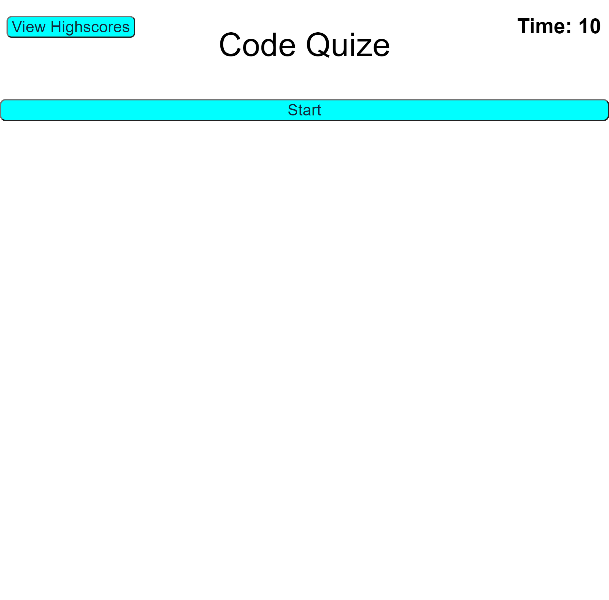

# code-quize
## description
This application is a quiz game.You answer some multiple chioce questions and then enter your initial and then you can see your score and can compare your score with other players.
## instruction
When hit start button, you will presented with question and timer starts.When choose your answer,you will see next question. You should finish all questions before time is up,otherwise you get negative score for the ones you did not answer on time.If you answer wrong you will get 3 seconds time penalty.when you finish quiz,then you enter your initial and hit submit and your score will be saved in local storage. To see all saved scores,you can click on "View Highscores".

here is a screenshot of the page:

You can access to web page by following link:
